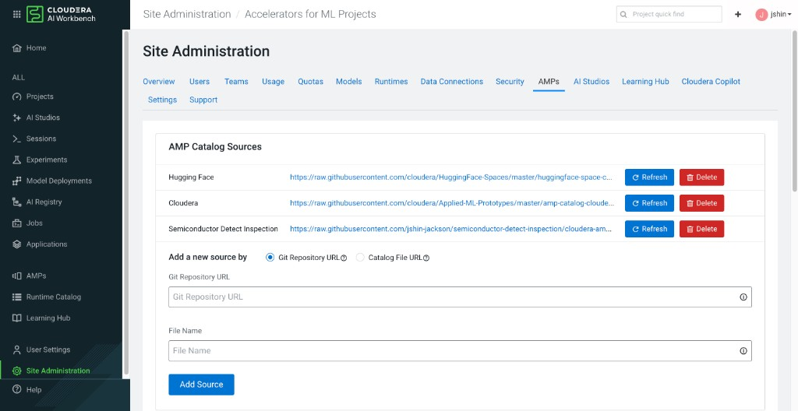
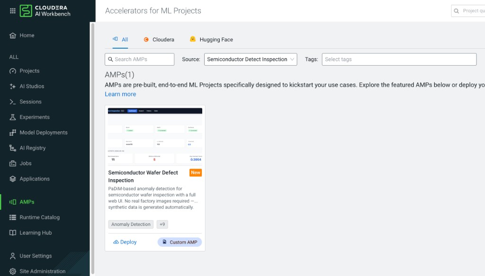
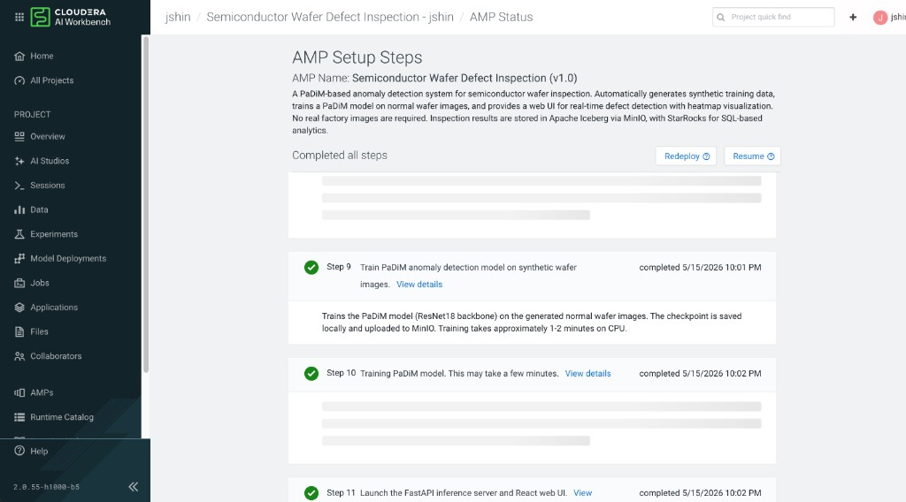
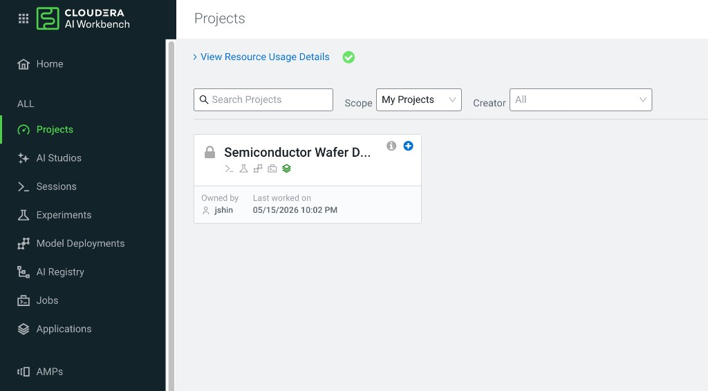
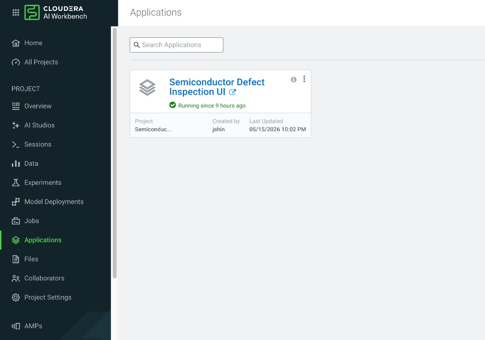
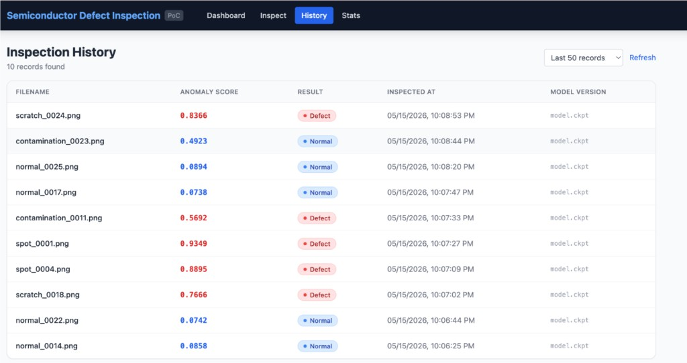
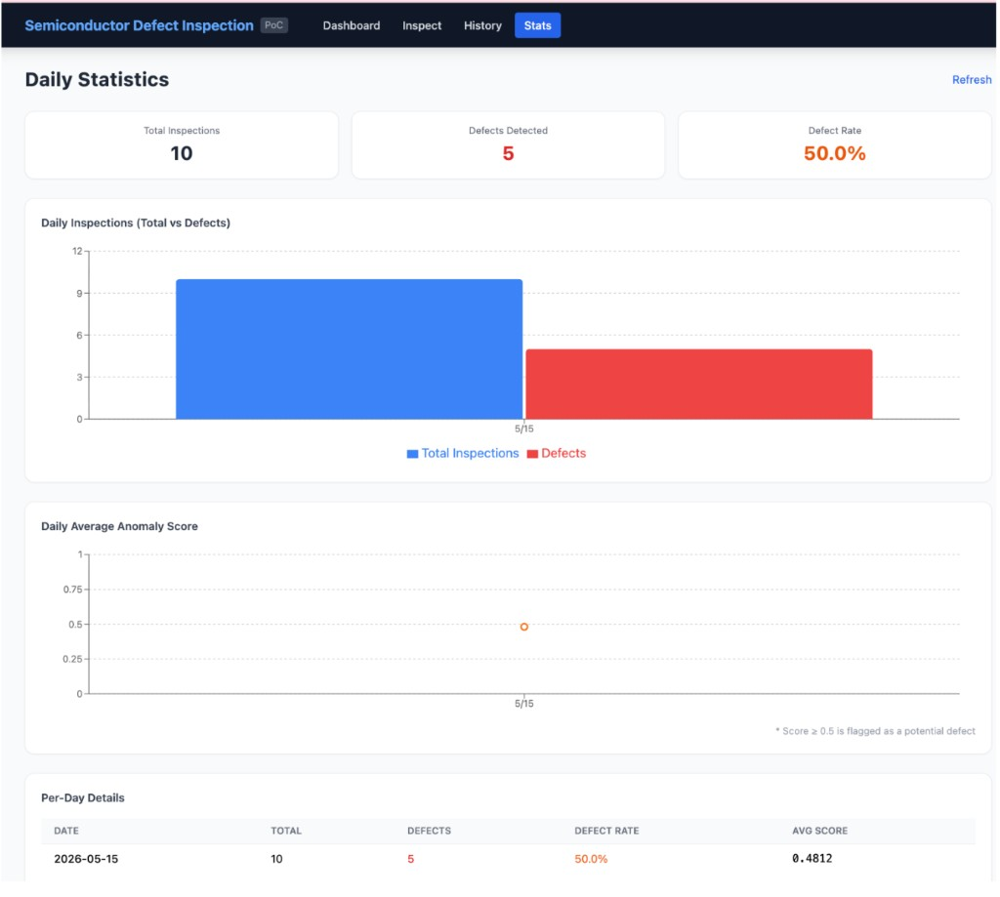

# 2026 MBO (Management By Objectives)

## Objective

> Build a complete, end-to-end AI/ML application on the **Cloudera AI platform** from scratch — covering model development, API design, frontend engineering, infrastructure automation, and AMP deployment — entirely through self-directed study.

## Key Results

| # | What I learned | How I demonstrated it |
|---|---------------|----------------------|
| 1 | **Anomaly detection (PaDiM)** | Trained a ResNet18-backed PaDiM model on synthetic wafer images; no real equipment data needed |
| 2 | **Full-stack ML application** | Built a FastAPI inference server + React web UI with 4 pages (Dashboard, Inspect, History, Stats) |
| 3 | **Data lakehouse stack** | Integrated Apache Iceberg, MinIO object storage, and StarRocks SQL analytics |
| 4 | **Cloudera AI AMP development** | Packaged the entire project as a one-click deployable AMP with automated setup tasks |
| 5 | **Production resilience** | Added automatic local filesystem + SQLite fallbacks so the app runs without any external services |

---

# Semiconductor Defect Inspection

## Deploy on Cloudera AI (AMP)

This project is registered as a **Cloudera AI AMP (Applied ML Prototype)**. You can deploy it in a few clicks — no manual setup needed.

### Step 1 — Add the Catalog Source

Go to **Site Administration → AMPs** and add a new source:

- **Type**: Catalog File URL
- **URL**: `https://raw.githubusercontent.com/jshin-jackson/semiconductor-detect-inspection/cloudera-amp-release/catalog.yaml`



---

### Step 2 — Find and Deploy the AMP

Go to **AMPs** in the left sidebar. Select **Semiconductor Detect Inspection** as the source filter. Click **Deploy** on the tile.



---

### Step 3 — AMP runs all setup steps automatically

The AMP installs all dependencies, generates training data, trains the model, and launches the web UI — no manual commands needed. All steps complete with a green checkmark.



---

### Step 4 — Project and Application are live

The project appears in your Projects list and the Application starts automatically.





---

### Step 5 — Open the Web UI

Click the application link to open the browser UI. All four pages work out of the box.

**Dashboard** — API server, model, MinIO, and StarRocks all show **Connected**. Today's inspection count, defect count, and average score update every 30 seconds.


**Inspect** — drag & drop a wafer image. The model scores it instantly. Normal images score near 0 (blue bar); defects score above 0.5 (red bar).


**History** — every inspection result is saved automatically and listed with filename, anomaly score, result badge, timestamp, and model version.



**Stats** — daily bar chart (total vs defects) and line chart (average anomaly score trend) with a per-day summary table.



> **No external services required.** When MinIO / StarRocks are not available, the app automatically uses local filesystem + SQLite so everything works in a self-contained CML environment.

---

## What is this?

> **"Upload a wafer image, and the AI tells you if there's a defect — in under 0.01 seconds."**

---

### A bit more detail

When making semiconductors, defects like scratches, contamination, or spots on a wafer (a round silicon disk) cause the product to fail.
Normally, a person inspects the wafer under a microscope. This project replaces that with an **AI model that looks at images and decides automatically**.

```
Upload a wafer image
        ↓
  AI model analyzes it
        ↓
"Normal" or "Defect detected (score: 0.94)"
        ↓
  Defect location shown as a heatmap
        ↓
  Inspection record saved to DB automatically
```

### 3 key highlights

| # | Highlight | Description |
|---|-----------|-------------|
| 1 | **No real factory images needed** | This project generates synthetic defect images and trains the AI on them |
| 2 | **Works right in the browser** | Go to `http://localhost:5173` → drag & drop an image → see results instantly |
| 3 | **Inspection history is recorded automatically** | View stats on when defects occurred, what images triggered them, and their scores |

### Screenshots

| Dashboard | Inspect |
|-----------|---------|
|  |  |

| History | Stats |
|---------|-------|
|  |  |

---

### How does it work technically?

1. **AI model (PaDiM)** — Trains only on normal images to learn "what normal looks like." When a new image comes in, it scores how different it is from normal (0–1). A score of 0.5 or higher is flagged as a defect.
2. **Backend API (FastAPI)** — Receives images, runs them through the model, saves results, and provides 6 API endpoints.
3. **Storage** — Heatmap images go to MinIO (object storage). Inspection records go to an Apache Iceberg table (queryable via StarRocks SQL).
4. **Infrastructure** — MinIO, Iceberg, and StarRocks all run as containers on Kubernetes. You only need Docker Desktop to run everything on a Mac.
5. **Web UI** — A React app in the browser handles everything from uploading images to viewing stats.

---

Based on the PaDiM (Patch Distribution Modeling) algorithm for semiconductor wafer anomaly detection.
The full pipeline — training, inference, analysis, and visualization — works entirely on synthetic data. No real equipment images required.

| Component | Details |
|-----------|---------|
| Model | PaDiM + ResNet18 (anomalib 1.x) |
| Data | Procedurally generated synthetic images (no real images needed) |
| API | FastAPI inference server (6 endpoints) |
| **Web UI** | **React 18 + Vite + TypeScript (4 pages)** |
| Infrastructure | Kubernetes (Docker Desktop) |
| Object Storage | MinIO |
| Table Format | Apache Iceberg (REST catalog) |
| Analytics DB | StarRocks |

---

## Architecture

```
[Auto-generate normal images] ──▶ [PaDiM training] ──▶ [Checkpoint] ──▶ MinIO (K8s)
                                                                              │
[Test image] ──▶ [FastAPI /predict] ──▶ Anomaly score ──▶ MinIO (heatmap)
                                               │
                                               └──▶ Iceberg table (MinIO)
                                                          │
                                                 StarRocks SQL analytics (K8s)
                                                          │
                                            [React Web UI :5173] ◀──┘
```

### Kubernetes resource layout

```
semiconductor-poc (Namespace)
├── minio               Deployment + LoadBalancer (9000 API, 9001 console)
├── minio-init          Job  (initializes warehouse bucket — mc alias set / mc anonymous set)
├── iceberg-rest        Deployment + LoadBalancer (8181, path-style S3)
├── starrocks-fe        Deployment + ClusterIP + LoadBalancer (9030)
└── starrocks-be        Deployment + ClusterIP + LoadBalancer (8040, initContainer waits for FE)
```

---

## Prerequisites

| Item | Version / Requirement |
|------|-----------------------|
| Python | **3.11** |
| Node.js | **18 or later** (for Web UI build) |
| Docker Desktop | Latest version (Apple Silicon supported) |
| Kubernetes | Enable in Docker Desktop settings, **v1.34.x or later** |
| kubectl | Included automatically with Docker Desktop |
| Memory (Docker Desktop) | **6 GB or more** recommended (StarRocks FE + BE running together) |

**Verify Kubernetes is enabled:**

```bash
kubectl cluster-info
# Kubernetes control plane is running at https://127.0.0.1:6443

kubectl version --short
# Server Version: v1.34.x
```

**Set Docker Desktop memory:**  
Docker Desktop → Settings → Resources → Memory ≥ 6 GB

---

## Quick Start

### Step 1. Install dependencies

Create a Python 3.11 virtual environment and install packages.

```bash
python3.11 -m venv .venv
source .venv/bin/activate
pip install -r requirements.txt
```

> `requirements.txt` pins compatible version ranges for Python 3.11, including `anomalib>=1.1.0,<2.0.0` and `torch>=2.1.0,<3.0.0`.

---

### Step 2. Deploy Kubernetes infrastructure

```bash
./scripts/k8s-deploy.sh
```

The script does the following in order:

1. Creates the `semiconductor-poc` namespace
2. Deploys MinIO Deployment + PVC (10 Gi) + LoadBalancer Service
3. Runs the `minio-init` Job to auto-create the `warehouse` bucket  
   (uses `mc alias set` / `mc anonymous set` — MinIO MC 2024 syntax)
4. Deploys the Iceberg REST catalog (with MinIO path-style S3 access configured)
5. Deploys StarRocks FE and waits for it to be ready
6. Deploys StarRocks BE (initContainer waits for FE port 9030, then registers automatically)

Service endpoints after deployment:

| Service | Address | Credentials |
|---------|---------|-------------|
| MinIO API | http://localhost:9000 | admin / password |
| MinIO Console | http://localhost:9001 | admin / password |
| Iceberg REST | http://localhost:8181 | — |
| StarRocks MySQL | localhost:9030 | root / (no password) |
| StarRocks BE HTTP | http://localhost:8040 | — |
| FastAPI | http://localhost:8000 | — |
| **Web UI** | **http://localhost:5173** | — |

**Monitor pod status:**

```bash
./scripts/k8s-deploy.sh --status
# or
kubectl get pods -n semiconductor-poc -w
```

> Note for M2 Mac: The StarRocks BE initContainer waits for FE to be ready before starting. Expect 2–3 minutes for everything to reach Ready.

---

### Step 3. Generate training data

```bash
# Normal images: 200 for data/train/good + 30 for data/test/good
python scripts/generate_normal_images.py

# Defect images: 30 for data/test/defect (scratch / spot / contamination)
python scripts/generate_defects.py
```

You can also pass options:

```bash
python scripts/generate_normal_images.py --train-count 300 --test-count 50 --size 256
python scripts/generate_defects.py --count 60 --seed 42
```

Generated normal wafer images use a grid pattern with Gaussian noise:


---

### Step 4. Initialize Iceberg table and StarRocks catalog

```bash
python scripts/setup_infra.py
```

This does:

- Verifies MinIO `warehouse` bucket sub-paths (`heatmaps/`, `weights/`)
- Creates the `default.inspection_results` Iceberg table (if it doesn't exist)
- Registers `iceberg_catalog` as an External Catalog in StarRocks (using in-cluster DNS)

> The `warehouse` bucket itself is already created in Step 2 by the `minio-init` Job.

---

### Step 5. Train the PaDiM model

```bash
python scripts/train.py
```

When done, the checkpoint is saved to `weights/` and automatically uploaded to MinIO at `warehouse/weights/`.

```bash
# Skip MinIO upload
python scripts/train.py --no-upload
```

> With ResNet18 + n_features=100, training on 200 images takes about 1–2 minutes on an M2 Mac (CPU).

---

### Step 6. Start the FastAPI inference server

```bash
.venv/bin/uvicorn api.main:app --host 0.0.0.0 --port 8000
```

Swagger UI: http://localhost:8000/docs

---

### Step 7. Run the Web UI

```bash
cd frontend
npm install   # only needed the first time
npm run dev
```

Open **http://localhost:5173** in your browser to see the Web UI.

> The FastAPI server (Step 6) must be running first.

---

## Web UI Pages

| Path | Page | Features |
|------|------|----------|
| `/` | Dashboard | Server / model / MinIO / StarRocks status badges, model metadata, today's stats (auto-refreshes every 30s) |
| `/inspect` | Inspect | Drag & drop image upload → anomaly score gauge + defect/normal badge |
| `/history` | History | Recent inspection records table (choose 20/50/100/200 rows) |
| `/stats` | Stats | Daily inspection count bar chart + average anomaly score line chart + data table |

### Web UI tech stack

| Item | Technology |
|------|------------|
| Framework | React 18 + Vite + TypeScript |
| Styling | Tailwind CSS |
| Charts | Recharts |
| Routing | React Router v6 |
| API | Vite proxy `/api/*` → `http://localhost:8000/*` |

---

## Screenshots

### Dashboard — Server status · Model info · Today's stats


> See the API server status, model load state, and MinIO / StarRocks connectivity at a glance. Today's inspection count, defect count, and average anomaly score are shown. Auto-refreshes every 30 seconds.

---

### Inspect — Upload an image and run inference


> Drag & drop a PNG / JPEG / BMP image to run it through the PaDiM model instantly. The result shows an anomaly score gauge (0–1) and a defect/normal badge. The heatmap is saved to MinIO automatically.

---

### History — Inspection record table


> Shows recent inspection records with columns for filename, anomaly score, defect status, timestamp, and model version. Row count can be set to 20 / 50 / 100 / 200.

---

### Stats — Daily inspection count & anomaly score chart


> Shows a Recharts bar chart (total vs. defect count) and a line chart (average anomaly score over time). A detailed table with per-day numbers is shown below.

---

## API Endpoints

### `GET /health` — Health check

```bash
curl http://localhost:8000/health
```

```json
{
  "status": "ok",
  "model_loaded": true,
  "minio_connected": true,
  "starrocks_connected": true,
  "version": "1.0.0"
}
```

---

### `POST /train` — Train the model via API

```bash
curl -X POST http://localhost:8000/train \
  -H "Content-Type: application/json" \
  -d '{}'
```

```json
{
  "status": "success",
  "checkpoint_path": "weights/semiconductor/.../best.ckpt",
  "minio_uri": "s3://warehouse/weights/best.ckpt",
  "duration_seconds": 45.2,
  "message": "Training complete. Model loaded into memory."
}
```

---

### `POST /predict` — Run anomaly detection

```bash
curl -X POST http://localhost:8000/predict \
  -F "file=@data/test/defect/scratch_0000.png"
```

```json
{
  "filename": "scratch_0000.png",
  "anomaly_score": 0.823456,
  "is_anomaly": true,
  "threshold": 0.5,
  "heatmap_minio_path": "s3://warehouse/heatmaps/uuid.png",
  "result_json_path": "/abs/path/data/results/uuid_result.json",
  "inference_id": "550e8400-e29b-41d4-a716-446655440000",
  "message": ""
}
```

---

### `GET /model` — Get loaded model info

```bash
curl http://localhost:8000/model
```

---

### `GET /history?n=20` — Get recent inspection history

```bash
curl "http://localhost:8000/history?n=20"
```

---

### `GET /stats` — Get daily anomaly detection stats

```bash
curl http://localhost:8000/stats
```

---

## StarRocks SQL Analytics

Connect directly with a MySQL client:

```bash
mysql -h 127.0.0.1 -P 9030 -u root
```

```sql
-- Last 50 inspection results
SELECT * FROM iceberg_catalog.default.inspection_results
ORDER BY timestamp DESC LIMIT 50;

-- Today's anomaly count
SELECT COUNT(*) AS anomaly_count
FROM iceberg_catalog.default.inspection_results
WHERE is_anomaly = true
  AND DATE(timestamp) = CURDATE();

-- Daily inspection count and anomaly rate
SELECT
  DATE(timestamp) AS dt,
  COUNT(*)        AS total,
  SUM(is_anomaly) AS anomaly,
  ROUND(SUM(is_anomaly) * 100.0 / COUNT(*), 1) AS anomaly_pct
FROM iceberg_catalog.default.inspection_results
GROUP BY dt
ORDER BY dt DESC;

-- Average anomaly score trend
SELECT DATE(timestamp) AS dt, ROUND(AVG(anomaly_score), 4) AS avg_score
FROM iceberg_catalog.default.inspection_results
GROUP BY dt ORDER BY dt DESC;
```

---

## Kubernetes Manifests

| File | Resource | Description |
|------|----------|-------------|
| `k8s/00-namespace.yaml` | Namespace | `semiconductor-poc` |
| `k8s/01-minio.yaml` | PVC + Deployment + Service | MinIO 10 Gi, LoadBalancer 9000/9001 |
| `k8s/02-iceberg-rest.yaml` | Deployment + Service | Iceberg REST, LoadBalancer 8181, `PATH_STYLE_ACCESS=true` |
| `k8s/03-starrocks-fe.yaml` | Deployment + ClusterIP + LoadBalancer | FE, MySQL port 9030 |
| `k8s/04-starrocks-be.yaml` | Deployment + ClusterIP + LoadBalancer | BE, initContainer waits for FE, HTTP 8040 |
| `k8s/05-minio-init-job.yaml` | Job | `mc alias set` + `mc anonymous set`, auto-deleted 60s after completion |

**In-cluster service DNS (pod-to-pod communication):**

| Service | Internal Address |
|---------|-----------------|
| MinIO | `http://minio:9000` |
| Iceberg REST | `http://iceberg-rest:8181` |
| StarRocks FE | `starrocks-fe:9030` |
| StarRocks BE | `starrocks-be:9050` (heartbeat) |

**Deployment management commands:**

```bash
# Deploy everything
./scripts/k8s-deploy.sh

# Check pod / service / job status
./scripts/k8s-deploy.sh --status

# Delete everything (including PVC data)
./scripts/k8s-deploy.sh --delete

# Restart a specific Deployment
kubectl rollout restart deployment/starrocks-fe -n semiconductor-poc
kubectl rollout restart deployment/minio         -n semiconductor-poc

# Tail live logs
kubectl logs -f deployment/starrocks-fe  -n semiconductor-poc
kubectl logs -f deployment/starrocks-be  -n semiconductor-poc
kubectl logs -f deployment/minio         -n semiconductor-poc
kubectl logs -f deployment/iceberg-rest  -n semiconductor-poc

# minio-init Job logs (for debugging failures)
kubectl logs job/minio-init -n semiconductor-poc
```

---

## Project Structure

```
semiconductor-detect-inspection/
├── frontend/                          # React Web UI (Vite + TypeScript)
│   ├── src/
│   │   ├── api/client.ts              # FastAPI fetch wrapper + TypeScript types
│   │   ├── components/
│   │   │   ├── Navbar.tsx             # Top navigation bar
│   │   │   ├── StatusBadge.tsx        # Status badge (ok / anomaly / normal, etc.)
│   │   │   └── ScoreBar.tsx           # Anomaly score gauge bar
│   │   ├── pages/
│   │   │   ├── DashboardPage.tsx      # Dashboard (status cards + stats summary)
│   │   │   ├── InspectPage.tsx        # Inspect page (drag & drop + results)
│   │   │   ├── HistoryPage.tsx        # History table
│   │   │   └── StatsPage.tsx          # Daily stats chart
│   │   ├── App.tsx                    # Router + layout
│   │   └── main.tsx                   # Entry point
│   ├── vite.config.ts                 # Vite config + API proxy
│   ├── tailwind.config.js
│   └── package.json
├── k8s/
│   ├── 00-namespace.yaml              # semiconductor-poc namespace
│   ├── 01-minio.yaml                  # MinIO PVC + Deployment + Service
│   ├── 02-iceberg-rest.yaml           # Iceberg REST catalog (path-style S3)
│   ├── 03-starrocks-fe.yaml           # StarRocks FE
│   ├── 04-starrocks-be.yaml           # StarRocks BE (initContainer)
│   └── 05-minio-init-job.yaml         # warehouse bucket initialization Job
├── data/
│   ├── train/good/                    # Normal training images (auto-generated)
│   ├── test/good/                     # Normal test images (auto-generated)
│   ├── test/defect/                   # Defect test images (auto-generated)
│   └── results/                       # Inference result JSON + local heatmap copies
├── src/
│   ├── synthetic_defects.py           # Defect generation module (scratch / spot / contamination)
│   ├── utils.py                       # Heatmap generation, config loading, utilities
│   ├── storage.py                     # MinIO SDK client
│   ├── iceberg_writer.py              # PyIceberg result writer
│   └── database.py                    # StarRocks pymysql client
├── api/
│   ├── main.py                        # FastAPI app + lifespan
│   ├── state.py                       # Global state (model, clients)
│   ├── schemas.py                     # Pydantic request/response schemas
│   └── routes/
│       ├── predict.py                 # /health, /predict, /history, /stats
│       └── train.py                   # /train, /model
├── scripts/
│   ├── generate_normal_images.py      # Auto-generate normal wafer images
│   ├── generate_defects.py            # Auto-generate defect images
│   ├── train.py                       # Standalone PaDiM training script
│   ├── setup_infra.py                 # Initialize Iceberg table + StarRocks catalog
│   └── k8s-deploy.sh                  # Kubernetes infrastructure deployment script
├── configs/
│   └── config.yaml                    # Global config (model, paths, external service addresses)
├── weights/                           # Local checkpoint storage directory
└── requirements.txt                   # Python 3.11 compatible dependencies (version ranges pinned)
```

---

## Configuration (`configs/config.yaml`)

Key settings:

| Section | Key | Default | Description |
|---------|-----|---------|-------------|
| `model` | `backbone` | `resnet18` | Feature extraction backbone |
| `model` | `accelerator` | `cpu` | `cpu` or `mps` (M2 experimental) |
| `model` | `n_features` | `100` | PaDiM random feature dimensions (higher = more accurate but slower) |
| `inference` | `threshold` | `0.5` | Anomaly detection threshold |
| `minio` | `endpoint` | `localhost:9000` | MinIO external access address |
| `iceberg` | `rest_uri` | `http://localhost:8181` | Iceberg REST catalog external address |
| `starrocks` | `host` | `localhost` | StarRocks MySQL host |
| `starrocks` | `port` | `9030` | StarRocks MySQL port |
| `k8s_internal` | `minio_endpoint` | `http://minio...svc...` | StarRocks → MinIO in-cluster DNS |
| `k8s_internal` | `iceberg_rest_uri` | `http://iceberg-rest...svc...` | StarRocks → Iceberg in-cluster DNS |

---

## Synthetic Defect Types

| Defect Type | Description |
|-------------|-------------|
| `scratch` | 1–3 linear scratches in random directions |
| `spot` | 1–4 circular spots (bright or dark) |
| `contamination` | Irregular polygon contamination area with noisy texture overlay |

---

## Apple Silicon (M2) + Kubernetes Notes

- MinIO, Iceberg REST, and StarRocks all use **multi-arch (amd64/arm64) images**.
- PaDiM training is set to `accelerator: cpu` (anomalib MPS + memory bank operations are unstable).
- Docker Desktop LoadBalancer exposes services on `localhost` automatically — no manual port forwarding needed.
- The StarRocks BE initContainer waits for FE port 9030 before starting — no manual intervention required.
- Tested on Kubernetes v1.34.x (all resources use stable APIs: `v1`, `apps/v1`, `batch/v1`).

---

## Troubleshooting

### minio-init Job fails

```bash
kubectl logs job/minio-init -n semiconductor-poc
```

If MinIO isn't ready yet, re-run the Job:

```bash
kubectl delete job minio-init -n semiconductor-poc
kubectl apply -f k8s/05-minio-init-job.yaml
```

### StarRocks BE is not reaching Ready

```bash
kubectl describe pod -l app=starrocks-be -n semiconductor-poc
kubectl logs -l app=starrocks-be -n semiconductor-poc -c wait-for-fe
```

FE can take up to 3 minutes to fully start. Check the BE initContainer logs for a "FE ready" message.

### FastAPI model not loaded

```
[AppState] No checkpoint found. Please run POST /train first.
```

Run `python scripts/train.py` or call `POST /train` to train the model first, then restart the server.

### PyIceberg S3 access error

Check that the MinIO credentials (`access_key`, `secret_key`) in `configs/config.yaml` match the K8s MinIO environment variables (`MINIO_ROOT_USER=admin`, `MINIO_ROOT_PASSWORD=password`).

### Web UI can't connect to API

The Vite dev server (`npm run dev`) proxies `/api/*` requests to `http://localhost:8000`.
Make sure the FastAPI server is running on port 8000 first.

```bash
curl http://localhost:8000/health
```

---

## Out of Scope

- Cloud deployment
- Real-time equipment integration
- MES / FDC integration
- Multi-user environments
- GPU cluster training
