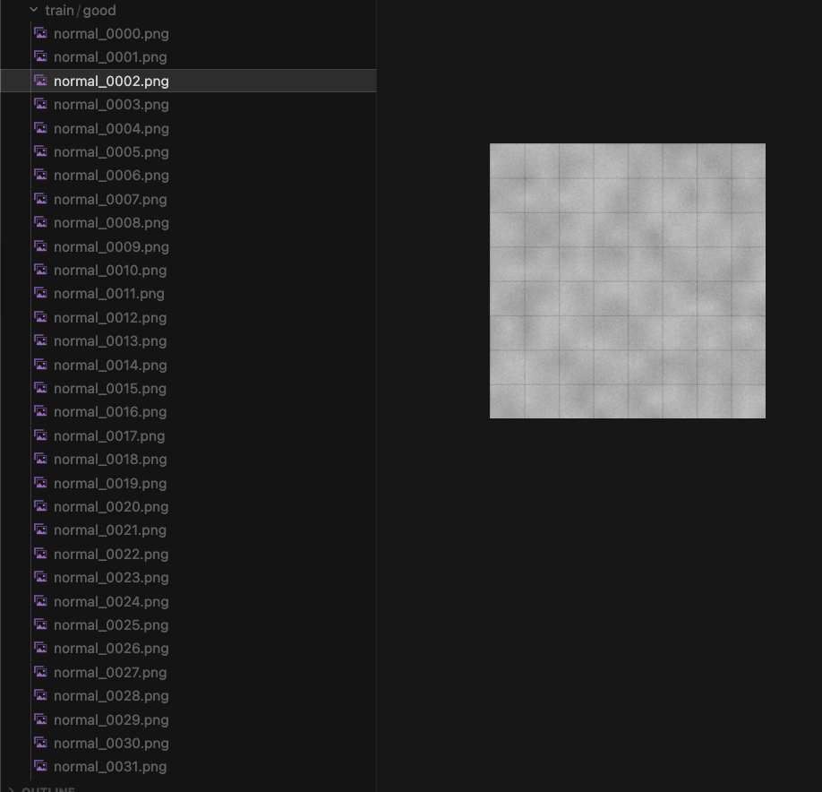
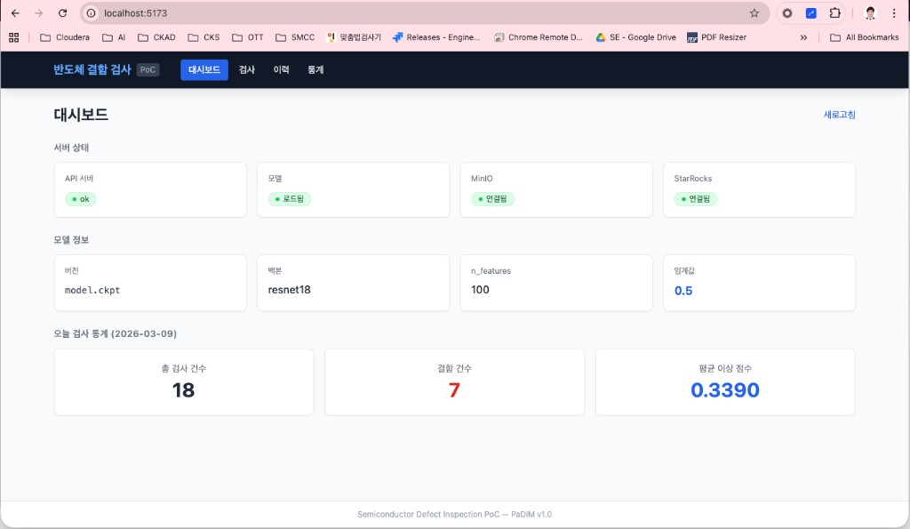
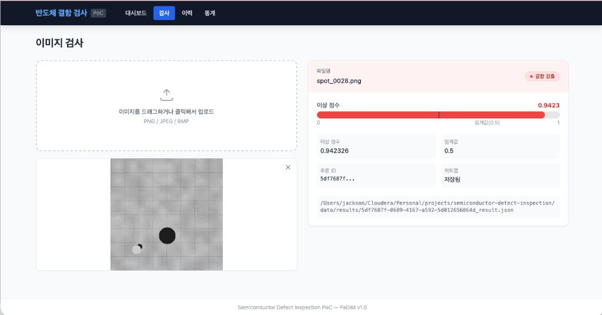
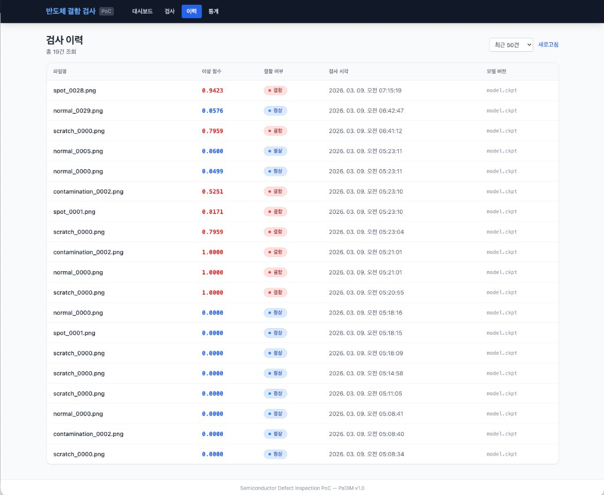
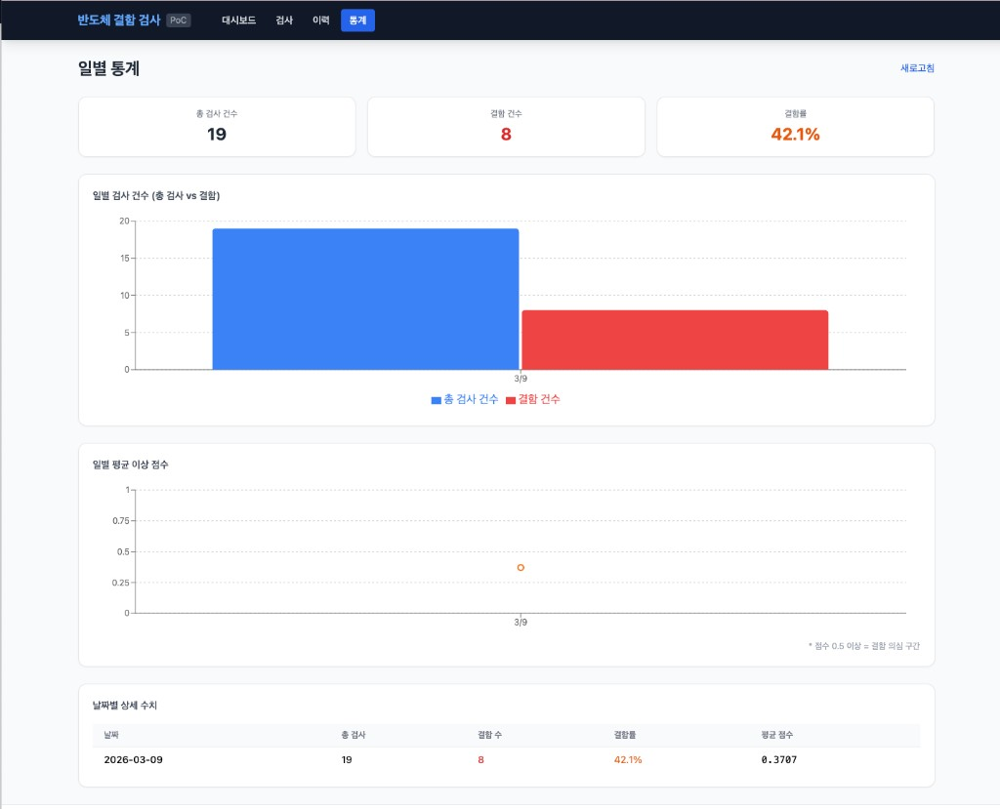

# 반도체 결함 검사 PoC

PaDiM(Patch Distribution Modeling) 알고리즘 기반의 반도체 웨이퍼 이상 탐지 기술 검증 프로젝트입니다.
실제 장비 이미지 없이도 합성 데이터만으로 학습·추론·분석·시각화 파이프라인 전체를 검증할 수 있습니다.

| 구분 | 내용 |
|------|------|
| 모델 | PaDiM + ResNet18 (anomalib 1.x) |
| 데이터 | 절차적 합성 이미지 자동 생성 (실제 이미지 불필요) |
| API | FastAPI 추론 서버 (6개 엔드포인트) |
| **Web UI** | **React 18 + Vite + TypeScript (4개 화면)** |
| 인프라 | Kubernetes (Docker Desktop) |
| 오브젝트 스토리지 | MinIO |
| 테이블 포맷 | Apache Iceberg (REST 카탈로그) |
| 분석 DB | StarRocks |

---

## 아키텍처

```
[정상 이미지 자동 생성] ──▶ [PaDiM 학습] ──▶ [체크포인트] ──▶ MinIO (K8s)
                                                                    │
[테스트 이미지] ──▶ [FastAPI /predict] ──▶ 이상 점수 ──▶ MinIO (히트맵)
                                               │
                                               └──▶ Iceberg 테이블 (MinIO)
                                                          │
                                                 StarRocks SQL 분석 (K8s)
                                                          │
                                            [React Web UI :5173] ◀──┘
```

### Kubernetes 리소스 구조

```
semiconductor-poc (Namespace)
├── minio               Deployment + LoadBalancer (9000 API, 9001 콘솔)
├── minio-init          Job  (warehouse 버킷 초기화 — mc alias set / mc anonymous set)
├── iceberg-rest        Deployment + LoadBalancer (8181, path-style S3 설정)
├── starrocks-fe        Deployment + ClusterIP + LoadBalancer (9030)
└── starrocks-be        Deployment + ClusterIP + LoadBalancer (8040, initContainer로 FE 대기)
```

---

## 사전 요구사항

| 항목 | 버전 / 조건 |
|------|-------------|
| Python | **3.11** |
| Node.js | **18 이상** (Web UI 빌드용) |
| Docker Desktop | 최신 버전 (Apple Silicon 지원) |
| Kubernetes | Docker Desktop 설정에서 활성화, **v1.34.x 이상** 확인 |
| kubectl | Docker Desktop 설치 시 자동 포함 |
| 메모리 (Docker Desktop) | **6 GB 이상** 권장 (StarRocks FE + BE 동시 구동) |

**Kubernetes 활성화 확인:**

```bash
kubectl cluster-info
# Kubernetes control plane is running at https://127.0.0.1:6443

kubectl version --short
# Server Version: v1.34.x
```

**Docker Desktop 메모리 설정:**  
Docker Desktop → Settings → Resources → Memory ≥ 6 GB

---

## 빠른 시작

### 1단계. 의존성 설치

Python 3.11 가상환경을 만들고 패키지를 설치합니다.

```bash
python3.11 -m venv .venv
source .venv/bin/activate
pip install -r requirements.txt
```

> `requirements.txt` 는 `anomalib>=1.1.0,<2.0.0`, `torch>=2.1.0,<3.0.0` 등 Python 3.11 호환 버전 범위로 고정되어 있습니다.

---

### 2단계. Kubernetes 인프라 배포

```bash
./scripts/k8s-deploy.sh
```

스크립트가 순서대로 수행하는 작업:

1. `semiconductor-poc` 네임스페이스 생성
2. MinIO Deployment + PVC(10 Gi) + LoadBalancer Service 배포
3. `minio-init` Job으로 `warehouse` 버킷 자동 생성  
   (`mc alias set` / `mc anonymous set` — MinIO MC 2024 버전 명령어 사용)
4. Iceberg REST 카탈로그 배포 (MinIO path-style S3 접근 설정 포함)
5. StarRocks FE 배포 및 준비 대기
6. StarRocks BE 배포 (initContainer가 FE 포트 9030 대기 후 자동 등록)

배포 후 서비스 접근 주소:

| 서비스 | 호스트 주소 | 자격증명 |
|--------|-------------|----------|
| MinIO API | http://localhost:9000 | admin / password |
| MinIO 콘솔 | http://localhost:9001 | admin / password |
| Iceberg REST | http://localhost:8181 | — |
| StarRocks MySQL | localhost:9030 | root / (비밀번호 없음) |
| StarRocks BE HTTP | http://localhost:8040 | — |
| FastAPI | http://localhost:8000 | — |
| **Web UI** | **http://localhost:5173** | — |

**파드 상태 모니터링:**

```bash
./scripts/k8s-deploy.sh --status
# 또는
kubectl get pods -n semiconductor-poc -w
```

> M2 Mac 참고: StarRocks BE의 initContainer가 FE 준비를 확인 후 기동하므로 전체 Ready 까지 2~3분 소요됩니다.

---

### 3단계. 학습 데이터 자동 생성

```bash
# 정상 이미지 생성: data/train/good 200장 + data/test/good 30장
python scripts/generate_normal_images.py

# 결함 이미지 생성: data/test/defect 30장 (scratch / spot / contamination)
python scripts/generate_defects.py
```

옵션을 지정할 수도 있습니다:

```bash
python scripts/generate_normal_images.py --train-count 300 --test-count 50 --size 256
python scripts/generate_defects.py --count 60 --seed 42
```

생성된 정상 웨이퍼 이미지는 다음과 같이 그리드 패턴과 가우시안 노이즈로 구성됩니다:



---

### 4단계. Iceberg 테이블 및 StarRocks 카탈로그 초기화

```bash
python scripts/setup_infra.py
```

수행 작업:

- MinIO `warehouse` 버킷 하위 경로 확인 (`heatmaps/`, `weights/`)
- Iceberg `default.inspection_results` 테이블 생성 (없으면 신규 생성)
- StarRocks `iceberg_catalog` External Catalog 등록 (클러스터 내부 DNS 사용)

> `warehouse` 버킷 자체는 2단계 `k8s-deploy.sh` 의 `minio-init` Job에서 이미 생성됩니다.

---

### 5단계. PaDiM 모델 학습

```bash
python scripts/train.py
```

완료 시 체크포인트가 `weights/` 에 저장되고 MinIO `warehouse/weights/` 에 자동 업로드됩니다.

```bash
# MinIO 업로드 건너뛰기
python scripts/train.py --no-upload
```

> ResNet18 + n_features=100 기준, 200장 학습 시 M2 Mac CPU 약 1~2분 소요.

---

### 6단계. FastAPI 추론 서버 시작

```bash
.venv/bin/uvicorn api.main:app --host 0.0.0.0 --port 8000
```

Swagger UI: http://localhost:8000/docs

---

### 7단계. Web UI 실행

```bash
cd frontend
npm install   # 최초 1회
npm run dev
```

브라우저에서 **http://localhost:5173** 을 열면 Web UI 가 표시됩니다.

> FastAPI 서버(6단계)가 먼저 실행 중이어야 합니다.

---

## Web UI 화면 구성

| 경로 | 화면 | 주요 기능 |
|------|------|-----------|
| `/` | 대시보드 | 서버·모델·MinIO·StarRocks 상태 배지, 모델 메타정보, 오늘 통계 카드 (30초 자동 갱신) |
| `/inspect` | 검사 | 드래그&드롭 이미지 업로드 → 이상 점수 게이지 + 결함/정상 판정 배지 |
| `/history` | 이력 | 최근 검사 이력 테이블 (조회 건수 20/50/100/200 선택 가능) |
| `/stats` | 통계 | 일별 검사 건수 막대 차트 + 평균 이상 점수 꺾은선 차트 + 수치 테이블 |

### Web UI 기술 스택

| 항목 | 기술 |
|------|------|
| 프레임워크 | React 18 + Vite + TypeScript |
| 스타일 | Tailwind CSS |
| 차트 | Recharts |
| 라우팅 | React Router v6 |
| API 연동 | Vite proxy `/api/*` → `http://localhost:8000/*` |

---

## 스크린샷

### 대시보드 — 서버 상태 · 모델 정보 · 오늘의 검사 통계



> API 서버, 모델 로드 여부, MinIO / StarRocks 연결 상태를 한눈에 확인하고 오늘의 검사 건수 · 결함 건수 · 평균 이상 점수를 표시합니다. 30초마다 자동 갱신됩니다.

---

### 검사 — 이미지 업로드 및 결함 추론



> PNG / JPEG / BMP 이미지를 드래그&드롭하면 즉시 PaDiM 모델로 추론하여 이상 점수(0~1) 게이지와 결함/정상 판정 배지를 출력합니다. 히트맵은 MinIO에 자동 저장됩니다.

---

### 이력 — 검사 기록 테이블



> 최근 검사 이력을 파일명 · 이상 점수 · 결함 여부 · 검사 시각 · 모델 버전 컬럼으로 표시합니다. 조회 건수를 20 / 50 / 100 / 200 건으로 선택할 수 있습니다.

---

### 통계 — 일별 검사 건수 · 이상 점수 차트



> Recharts 막대 차트(총 검사 vs 결함 건수)와 꺾은선 차트(평균 이상 점수 추이)를 함께 표시합니다. 하단 테이블에서 날짜별 세부 수치를 확인할 수 있습니다.

---

## API 엔드포인트

### `GET /health` — 상태 확인

```bash
curl http://localhost:8000/health
```

```json
{
  "status": "ok",
  "model_loaded": true,
  "minio_connected": true,
  "starrocks_connected": true,
  "version": "1.0.0"
}
```

---

### `POST /train` — API를 통한 모델 학습

```bash
curl -X POST http://localhost:8000/train \
  -H "Content-Type: application/json" \
  -d '{}'
```

```json
{
  "status": "success",
  "checkpoint_path": "weights/semiconductor/.../best.ckpt",
  "minio_uri": "s3://warehouse/weights/best.ckpt",
  "duration_seconds": 45.2,
  "message": "학습 완료. 모델이 메모리에 로드되었습니다."
}
```

---

### `POST /predict` — 이상 탐지 추론

```bash
curl -X POST http://localhost:8000/predict \
  -F "file=@data/test/defect/scratch_0000.png"
```

```json
{
  "filename": "scratch_0000.png",
  "anomaly_score": 0.823456,
  "is_anomaly": true,
  "threshold": 0.5,
  "heatmap_minio_path": "s3://warehouse/heatmaps/uuid.png",
  "result_json_path": "/abs/path/data/results/uuid_result.json",
  "inference_id": "550e8400-e29b-41d4-a716-446655440000",
  "message": ""
}
```

---

### `GET /model` — 로드된 모델 정보

```bash
curl http://localhost:8000/model
```

---

### `GET /history?n=20` — 최근 검사 이력

```bash
curl "http://localhost:8000/history?n=20"
```

---

### `GET /stats` — 일별 이상 탐지 통계

```bash
curl http://localhost:8000/stats
```

---

## StarRocks SQL 분석

MySQL 클라이언트로 직접 쿼리할 수 있습니다:

```bash
mysql -h 127.0.0.1 -P 9030 -u root
```

```sql
-- 최근 검사 결과 50건
SELECT * FROM iceberg_catalog.default.inspection_results
ORDER BY timestamp DESC LIMIT 50;

-- 오늘 이상 탐지 건수
SELECT COUNT(*) AS anomaly_count
FROM iceberg_catalog.default.inspection_results
WHERE is_anomaly = true
  AND DATE(timestamp) = CURDATE();

-- 일별 검사 건수 및 이상률
SELECT
  DATE(timestamp) AS dt,
  COUNT(*)        AS total,
  SUM(is_anomaly) AS anomaly,
  ROUND(SUM(is_anomaly) * 100.0 / COUNT(*), 1) AS anomaly_pct
FROM iceberg_catalog.default.inspection_results
GROUP BY dt
ORDER BY dt DESC;

-- 평균 이상 점수 추이
SELECT DATE(timestamp) AS dt, ROUND(AVG(anomaly_score), 4) AS avg_score
FROM iceberg_catalog.default.inspection_results
GROUP BY dt ORDER BY dt DESC;
```

---

## Kubernetes 매니페스트 상세

| 파일 | 리소스 | 설명 |
|------|--------|------|
| `k8s/00-namespace.yaml` | Namespace | `semiconductor-poc` |
| `k8s/01-minio.yaml` | PVC + Deployment + Service | MinIO 10 Gi, LoadBalancer 9000/9001 |
| `k8s/02-iceberg-rest.yaml` | Deployment + Service | Iceberg REST, LoadBalancer 8181, `PATH_STYLE_ACCESS=true` |
| `k8s/03-starrocks-fe.yaml` | Deployment + ClusterIP + LoadBalancer | FE, MySQL 포트 9030 |
| `k8s/04-starrocks-be.yaml` | Deployment + ClusterIP + LoadBalancer | BE, initContainer(FE 대기), HTTP 8040 |
| `k8s/05-minio-init-job.yaml` | Job | `mc alias set` + `mc anonymous set`, 완료 60초 후 자동 삭제 |

**클러스터 내부 서비스 DNS (파드 간 통신):**

| 서비스 | 내부 주소 |
|--------|-----------|
| MinIO | `http://minio:9000` |
| Iceberg REST | `http://iceberg-rest:8181` |
| StarRocks FE | `starrocks-fe:9030` |
| StarRocks BE | `starrocks-be:9050` (heartbeat) |

**배포 관리 명령어:**

```bash
# 전체 배포
./scripts/k8s-deploy.sh

# 파드 / 서비스 / 잡 상태 확인
./scripts/k8s-deploy.sh --status

# 전체 삭제 (PVC 데이터 포함)
./scripts/k8s-deploy.sh --delete

# 특정 Deployment 재시작
kubectl rollout restart deployment/starrocks-fe -n semiconductor-poc
kubectl rollout restart deployment/minio         -n semiconductor-poc

# 실시간 로그 확인
kubectl logs -f deployment/starrocks-fe  -n semiconductor-poc
kubectl logs -f deployment/starrocks-be  -n semiconductor-poc
kubectl logs -f deployment/minio         -n semiconductor-poc
kubectl logs -f deployment/iceberg-rest  -n semiconductor-poc

# minio-init Job 로그 (실패 시 디버깅)
kubectl logs job/minio-init -n semiconductor-poc
```

---

## 프로젝트 구조

```
semiconductor-detect-inspection/
├── frontend/                          # React Web UI (Vite + TypeScript)
│   ├── src/
│   │   ├── api/client.ts              # FastAPI fetch 래퍼 + TypeScript 타입
│   │   ├── components/
│   │   │   ├── Navbar.tsx             # 상단 내비게이션 바
│   │   │   ├── StatusBadge.tsx        # 상태 배지 (ok / anomaly / normal 등)
│   │   │   └── ScoreBar.tsx           # 이상 점수 게이지 바
│   │   ├── pages/
│   │   │   ├── DashboardPage.tsx      # 대시보드 (상태 카드 + 통계 요약)
│   │   │   ├── InspectPage.tsx        # 검사 화면 (드래그&드롭 + 결과)
│   │   │   ├── HistoryPage.tsx        # 이력 테이블
│   │   │   └── StatsPage.tsx          # 일별 통계 차트
│   │   ├── App.tsx                    # Router + 레이아웃
│   │   └── main.tsx                   # 진입점
│   ├── vite.config.ts                 # Vite 설정 + API proxy
│   ├── tailwind.config.js
│   └── package.json
├── k8s/
│   ├── 00-namespace.yaml              # semiconductor-poc 네임스페이스
│   ├── 01-minio.yaml                  # MinIO PVC + Deployment + Service
│   ├── 02-iceberg-rest.yaml           # Iceberg REST 카탈로그 (path-style S3)
│   ├── 03-starrocks-fe.yaml           # StarRocks FE
│   ├── 04-starrocks-be.yaml           # StarRocks BE (initContainer)
│   └── 05-minio-init-job.yaml         # warehouse 버킷 초기화 Job
├── data/
│   ├── train/good/                    # 정상 학습 이미지 (자동 생성)
│   ├── test/good/                     # 정상 테스트 이미지 (자동 생성)
│   ├── test/defect/                   # 결함 테스트 이미지 (자동 생성)
│   └── results/                       # 추론 결과 JSON + 히트맵 로컬 사본
├── src/
│   ├── synthetic_defects.py           # 결함 생성 모듈 (scratch / spot / contamination)
│   ├── utils.py                       # 히트맵 생성, 설정 로드 등 유틸리티
│   ├── storage.py                     # MinIO SDK 클라이언트
│   ├── iceberg_writer.py              # PyIceberg 결과 기록
│   └── database.py                    # StarRocks pymysql 클라이언트
├── api/
│   ├── main.py                        # FastAPI 앱 + lifespan
│   ├── state.py                       # 전역 상태 (모델, 클라이언트)
│   ├── schemas.py                     # Pydantic 요청/응답 스키마
│   └── routes/
│       ├── predict.py                 # /health, /predict, /history, /stats
│       └── train.py                   # /train, /model
├── scripts/
│   ├── generate_normal_images.py      # 정상 웨이퍼 이미지 자동 생성
│   ├── generate_defects.py            # 결함 이미지 자동 생성
│   ├── train.py                       # 단독 PaDiM 학습 스크립트
│   ├── setup_infra.py                 # Iceberg 테이블 + StarRocks 카탈로그 초기화
│   └── k8s-deploy.sh                  # Kubernetes 인프라 배포 쉘 스크립트
├── configs/
│   └── config.yaml                    # 전체 설정 (모델, 경로, 외부 서비스 주소)
├── weights/                           # 체크포인트 로컬 저장 디렉터리
└── requirements.txt                   # Python 3.11 호환 의존성 (버전 범위 고정)
```

---

## 설정 파일 (`configs/config.yaml`)

주요 설정 항목:

| 섹션 | 항목 | 기본값 | 설명 |
|------|------|--------|------|
| `model` | `backbone` | `resnet18` | 특징 추출 백본 |
| `model` | `accelerator` | `cpu` | `cpu` 또는 `mps` (M2 실험적 지원) |
| `model` | `n_features` | `100` | PaDiM 랜덤 차원 수 (클수록 정밀, 느림) |
| `inference` | `threshold` | `0.5` | 이상 판정 임계값 |
| `minio` | `endpoint` | `localhost:9000` | MinIO 외부 접근 주소 |
| `iceberg` | `rest_uri` | `http://localhost:8181` | Iceberg REST 카탈로그 외부 주소 |
| `starrocks` | `host` | `localhost` | StarRocks MySQL 호스트 |
| `starrocks` | `port` | `9030` | StarRocks MySQL 포트 |
| `k8s_internal` | `minio_endpoint` | `http://minio...svc...` | StarRocks→MinIO 클러스터 내부 DNS |
| `k8s_internal` | `iceberg_rest_uri` | `http://iceberg-rest...svc...` | StarRocks→Iceberg 클러스터 내부 DNS |

---

## 합성 결함 종류

| 결함 타입 | 설명 |
|-----------|------|
| `scratch` | 랜덤 방향 직선 스크래치 1~3개 |
| `spot` | 밝거나 어두운 원형 점 결함 1~4개 |
| `contamination` | 불규칙 다각형 오염 영역 + 노이즈 텍스처 오버레이 |

---

## Apple Silicon (M2) + Kubernetes 참고 사항

- MinIO, Iceberg REST, StarRocks 모두 **multi-arch(amd64/arm64) 이미지** 제공.
- PaDiM 학습은 `accelerator: cpu`로 설정 (anomalib MPS + 메모리 뱅크 연산 불안정).
- Docker Desktop LoadBalancer는 포트 포워딩 없이 `localhost` 로 자동 노출.
- StarRocks BE initContainer가 FE 포트(9030) 준비를 확인 후 자동 기동 — 수동 개입 불필요.
- Kubernetes v1.34.x 확인 완료 (`v1`, `apps/v1`, `batch/v1` 모두 stable API 사용).

---

## 트러블슈팅

### minio-init Job 실패

```bash
kubectl logs job/minio-init -n semiconductor-poc
```

MinIO가 아직 준비되지 않은 경우 Job을 재실행합니다:

```bash
kubectl delete job minio-init -n semiconductor-poc
kubectl apply -f k8s/05-minio-init-job.yaml
```

### StarRocks BE가 Ready 되지 않음

```bash
kubectl describe pod -l app=starrocks-be -n semiconductor-poc
kubectl logs -l app=starrocks-be -n semiconductor-poc -c wait-for-fe
```

FE가 완전히 기동하기까지 최대 3분 소요. BE initContainer 로그에서 "FE 준비 완료" 메시지를 확인합니다.

### FastAPI 모델 미로드

```
[AppState] 저장된 체크포인트 없음. POST /train 으로 학습 후 사용하세요.
```

`python scripts/train.py` 또는 `POST /train` 으로 학습을 먼저 완료한 뒤 서버를 재시작합니다.

### PyIceberg S3 접근 오류

`configs/config.yaml` 의 MinIO 자격증명(`access_key`, `secret_key`)과 K8s MinIO 환경변수(`MINIO_ROOT_USER=admin`, `MINIO_ROOT_PASSWORD=password`)가 일치하는지 확인합니다.

### Web UI 가 API에 연결되지 않음

Vite dev server(`npm run dev`)는 `/api/*` 요청을 `http://localhost:8000` 으로 프록시합니다.
FastAPI 서버가 포트 8000에서 실행 중인지 먼저 확인하세요.

```bash
curl http://localhost:8000/health
```

---

## 제외 범위

- 클라우드 배포
- 실시간 장비 연동
- MES / FDC 연동
- 다중 사용자 환경
- GPU 클러스터 학습
